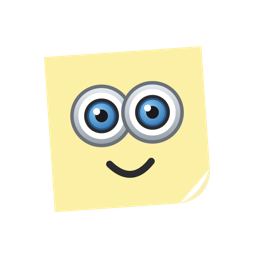

<p align="center">
  
</p>

<h1 align="center">Sticky Prompter</h1>

<p align="center">
A voice-controlled sticky-note teleprompter that floats on top of any active window.<br>
It listens as you speak and follows along with your script - no scrolling, no clicking.
</p>

---

## What it does

-  **Voice tracking** - read your script and the highlight follows you, word by word. Pause, ad-lib, or skip a sentence and it catches up.
-  **Always on top** - the note floats over Zoom, Meet, FaceTime, OBS, and full-screen apps. Park it right under your camera so your eyes stay near the lens.
-  **Invisible in screen shares and recordings** (macOS app) - you see it, your audience doesn't.
-  **Any background color + transparency slider**, text auto-adjusts for readability.
-  **Edit and live modes** - type your script directly on the note in a normal window, then go live: every button disappears and only your words remain. Double-click to edit again.
-  **Script library** - save scripts as plain text files, reload them anytime.
-  **Private** - everything runs locally; speech recognition is Apple's (macOS) or the browser's (web).

## Install (macOS)

**Option 1 - download:** grab `StickyPrompter.dmg` from the [latest release](../../releases/latest), open it, drag the app to Applications. On first open, macOS will warn about an unverified developer - go to **System Settings → Privacy & Security → "Open Anyway"** (one time only). This app is shared without Apple's $99/year notarization, hence the warning.

**Option 2 - build from source** (needs Xcode Command Line Tools):

```bash
git clone https://github.com/zhang-liz/sticky-prompter.git
cd sticky-prompter/mac
./build.sh install
```

Then launch **Sticky Prompter** from Spotlight. Allow Microphone and Speech Recognition on first mic use.

## Web version

There's also a browser version in [`web/`](web/) that runs in Chrome using the Web Speech API and Document Picture-in-Picture - always-on-top, but without transparency or capture-hiding. See its [readme](web/README.md).

## How the voice tracking works

The script is tokenized and matched word-by-word against the live transcription:

- a spoken word only advances the tracker if it matches the **next** script word (fuzzy matching handles mis-transcriptions on words of 4+ letters; short words must match exactly)
- **skipping ahead** requires two consecutive spoken words matching two consecutive script words within a 12-word lookahead
- each utterance is re-evaluated from its start as the recognizer revises itself, and the macOS app **biases recognition toward your script's vocabulary** for better accuracy on names and jargon

Run the matcher test suite: `./StickyPrompter.app/Contents/MacOS/StickyPrompter --selftest`

## License

[MIT](LICENSE) © Liz Zhang
